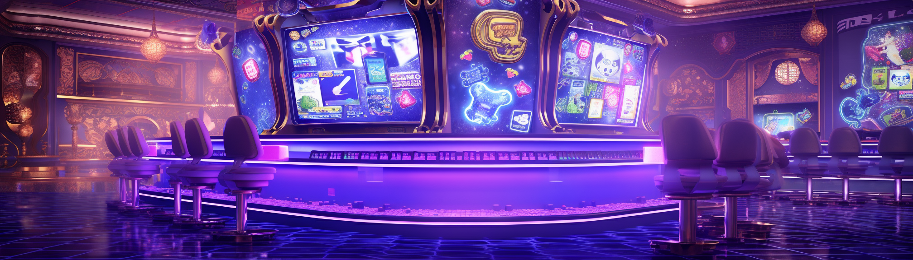

# Ronin Casino

Ronin Casino, operating on the Ethereum network, represents the next generation of decentralized gaming. Harnessing cutting-edge smart contract technology, our platform guarantees unparalleled transparency throughout all our games. Over time, we're set to expand our portfolio with an array of modular casino games, ranging from blackjack and dice to coin flips and beyond.

<figure><figcaption></figcaption></figure>

Our core philosophy revolves around user privacy, ensuring that players can engage anonymously while enjoying a secure and fluid gaming experience. What sets Ronin Casino apart is our enhanced odds, giving players a heightened chance of success. Gameplay is streamlined through the use of our native Ronin tokens for both betting and rewards.

Looking ahead, we're excited to broaden our horizons by integrating partnership tokens, including stable coins. This strategic move aims to attract a wider audience, enabling newcomers to participate without the initial need to invest in Ronin tokens.
